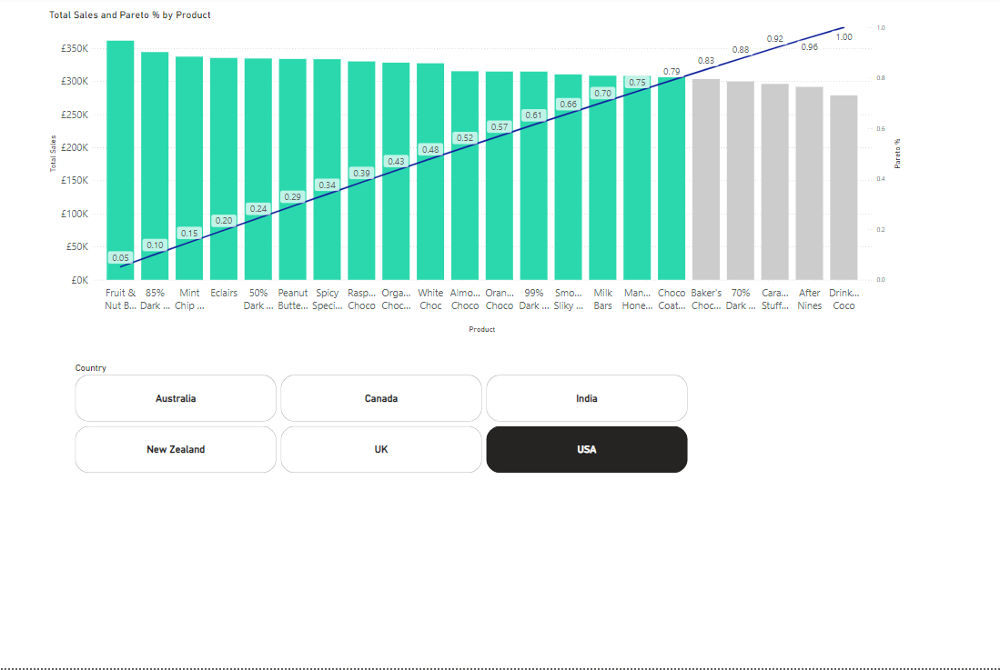

This repository contains Power BI reports displaying different visuals
Several types of metrics are displayed in the visual using various DAX formulas including:

- Top products and their contributions to overall sales
- Ranking of retailers/Store
- Totals
- Monthly average
- Latest month total
- Sales performance by employees vs targets
- Monthly target measurements
- Pareto Analysis

